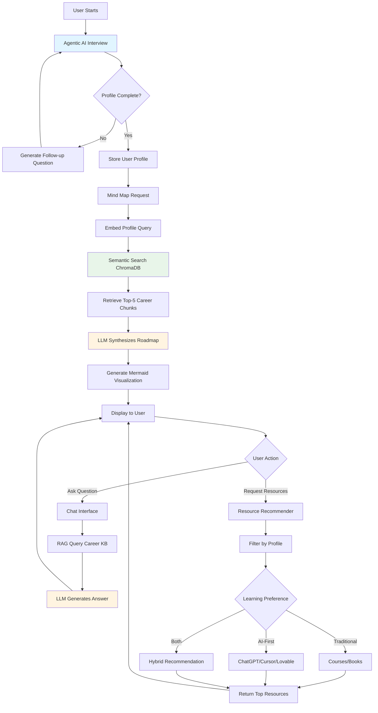

<<<<<<< HEAD
<<<<<<< HEAD
# 🎯 AI-Powered Personalized Career Guidance Platform

[](https://www.python.org/downloads/)
[](https://langchain.com/)
[](https://github.com/GenAIVersity)

> An intelligent career counseling system that creates personalized career roadmaps using RAG, Agentic AI, and LLMs to guide students toward their ideal career paths with modern AI-first learning recommendations.

---

## 📋 Problem Statement

Students and individuals face critical challenges when choosing career paths:

- **Information Overload**: Thousands of career options and conflicting advice create decision paralysis
- **Generic Guidance**: One-size-fits-all advice that ignores individual personas, learning styles, and circumstances
- **Outdated Methodology**: Career advisors recommend only traditional learning (courses, degrees) without awareness of modern AI-first tools (Cursor, Lovable, ChatGPT, etc.)
- **Lack of Personalization**: Current solutions don't consider location, interests, current academic standing, or learning preferences
- **No Actionable Roadmap**: Missing clear, visual, step-by-step paths from current state to goal achievement
- **Modern vs Traditional Gap**: Students unaware that building apps can take 6-12 months with traditional coding OR 1-2 weeks using AI-assisted tools

**Impact**: Wrong career choices, wasted time/resources, missed opportunities in emerging fields, inefficient learning paths using outdated methodologies.

---

## 💡 Proposed Solution

An intelligent platform combining **Agentic AI, RAG, and LLMs** for truly personalized career guidance:

### Core Features

1. **Intelligent Persona Profiling Agent** - Conducts adaptive interviews capturing location, goals, interests, academic standing, learning style, and time availability
2. **RAG-Powered Career Knowledge Engine** - Maintains up-to-date knowledge base of careers, skills, trends, and resources
3. **Dynamic Mind Map Generator** - Creates NotebookLM-style interactive hierarchical visualizations (Career → Sub-Domains → Skills → Resources)
4. **Contextual Chat Interface** - LLM-powered Q&A with conversation memory and profile context
5. **Modern Resource Recommender** - Dual-track recommendations: Traditional (courses, books) AND AI-First (ChatGPT, Cursor, Lovable, Firebase)

---

## 🏗️ Minimum Viable Product (MVP)

### ✅ In-Scope (24-Hour Hackathon)

- **Persona Profiling Module**: 8-12 adaptive questions using Agentic AI → Structured user profile JSON
- **Career Knowledge Base**: 20+ career domains, 100+ sub-specializations, 500+ skills, 200+ resources
- **RAG Pipeline**: Document chunking, embedding, ChromaDB storage, semantic search, LLM synthesis
- **Mind Map Generation**: LLM-powered roadmap structuring → Mermaid.js visualization (3-level hierarchy)
- **Career Chat Assistant**: LangChain ConversationalRetrievalChain with context memory
- **Resource Recommender**: Filters by profile, categorizes Traditional vs AI-First, returns top 5-10 with rationale

**Deliverables**: Jupyter Notebooks, Python scripts, sample knowledge base, README, requirements.txt, demo video

### ❌ Out of Scope

Real-time job APIs, user authentication, production UI, mobile apps, mentor matching, progress tracking, multi-language support

---

## 🛠️ Tech Stack

| Component | Technology | Purpose |
|-----------|-----------|---------|
| **Language** | Python 3.10+ | Core development |
| **Framework** | FastAPI | REST API endpoints |
| **AI Orchestration** | LangChain | RAG pipeline, agents, prompts |
| **LLM** | OpenAI GPT-4 / Claude 3.5 / Gemini 1.5 Pro | NLU, generation, reasoning |
| **Embeddings** | OpenAI text-embedding-3-small / HuggingFace all-MiniLM-L6-v2 | Semantic search |
| **Vector Database** | ChromaDB | Store/retrieve embedded knowledge |
| **Data Processing** | Pandas | Career data manipulation |
| **Visualization** | Mermaid.js | Mind map generation |
| **Validation** | Pydantic | Structured data models |
| **Environment** | Jupyter Notebook | Prototyping and demo |

---

## 🤖 Generative AI Technologies Used

### 1. **Large Language Models (LLMs)**
- **Models**: OpenAI GPT-4 / Claude 3.5 Sonnet / Gemini 1.5 Pro
- **Use Cases**: Persona analysis, career advice generation, conversational chat, mind map structuring, resource explanations

### 2. **Embeddings & Semantic Search**
- **Models**: OpenAI text-embedding-3-small (1536D) or HuggingFace all-MiniLM-L6-v2 (384D)
- **Use Cases**: Convert career documents to vectors, match user profiles to career paths semantically

### 3. **RAG (Retrieval Augmented Generation)**
- **Architecture**: LangChain + ChromaDB + LLM
- **Workflow**: 
  - **Indexing**: Career docs → Chunked (500 tokens) → Embedded → ChromaDB
  - **Retrieval**: User query → Embedded → Semantic search → Top-5 chunks
  - **Generation**: Retrieved chunks + Query → LLM → Synthesized answer with citations
- **Benefits**: Factual grounding, reduced hallucinations, source attribution, scalable updates

### 4. **Agentic AI (Autonomous Agents)**
- **Framework**: LangChain Agents (ReAct pattern)
- **Use Cases**: Adaptive persona profiling with dynamic follow-up questions, multi-turn conversations, tool calling (retrieval, recommendation)
- **Capabilities**: Reasoning → Action → Observation loop

### 5. **Prompt Engineering**
- **Techniques**: System prompts (career advisor persona), few-shot examples (mind map structures), chain-of-thought reasoning, context window optimization

### 6. **Structured Output Generation**
- **Technology**: Pydantic models + LangChain parsers
- **Use Cases**: Validated persona profile JSON, hierarchical career roadmap, resource metadata

### 7. **Guardrails & Evaluation**
- **Guardrails**: Input validation, content filtering, fallback responses, rate limiting
- **Evaluation**: RAG retrieval precision, response quality checks, hallucination detection
- **Limitations**: Static knowledge base, API-dependent, no authentication in MVP

---

## 📊 System Flow Diagram




## 🚀 Future Scope

1. **Real-Time Job Market Integration** - LinkedIn/Indeed APIs for live job postings, salary trends, demand metrics
2. **Adaptive Learning Paths** - Track user progress, adjust roadmap based on milestones, personalized skill gap analysis
3. **Multi-Modal Input** - Voice profiling (Whisper API), resume upload for skill extraction
4. **Mentor Matching System** - Connect users with industry professionals based on AI-powered matching
5. **Peer Learning Community** - Discussion forums, study groups, resource sharing by career domain
6. **Skill Certification & Verification** - Integration with Coursera/edX APIs, digital credential wallet
7. **Gamification** - Achievement badges, leaderboards, daily challenges, progress dashboard
8. **Multi-Language Support** - Hindi, Spanish, French, etc. with cultural context adaptation
9. **Educational Institution Integration** - White-label solution for schools/colleges with batch onboarding
10. **Mobile Applications** - iOS/Android apps with offline mode and push notifications
11. **Advanced AI** - Fine-tuned career counseling LLM, predictive analytics, personality assessment integration
12. **API & Developer Ecosystem** - Public API, Zapier connectors, Chrome extension, embeddable widgets

---
=======
# Firebase Studio
=======
# 🎯 AI-Powered Personalized Career Guidance Platform
>>>>>>> 4f8eb88 (File changes)

[](https://www.python.org/downloads/)
[](https://langchain.com/)
[](https://github.com/GenAIVersity)

<<<<<<< HEAD
To get started, take a look at src/app/page.tsx.
>>>>>>> dd6cf03 (Initialized workspace with Firebase Studio)
=======
> An intelligent career counseling system that creates personalized career roadmaps using RAG, Agentic AI, and LLMs to guide students and individuals toward their ideal career paths with modern, AI-first learning recommendations.

---

## 📋 Problem Statement

### The Challenge

Students and individuals today face **critical challenges** when choosing career paths:

1. **Information Overload**: Thousands of career options, learning resources, and conflicting advice create decision paralysis
2. **Generic Guidance**: Traditional career counseling provides one-size-fits-all advice that ignores individual personas, learning styles, and unique circumstances
3. **Outdated Methodology**: Career advisors often recommend only traditional learning paths (courses, degrees, certifications) without awareness of modern AI-first tools and no-code platforms
4. **Lack of Personalization**: Current solutions fail to consider:
   - Geographic location and regional opportunities
   - Individual interests, hobbies, and natural strengths
   - Current academic standing and age-appropriate guidance
   - Learning preferences (self-paced vs. structured, traditional coding vs. AI-assisted development)
5. **Missing Actionable Roadmap**: Even when career direction is identified, there's no clear, visual, step-by-step path from current state to goal achievement
6. **Modern vs. Traditional Gap**: Students are unaware of the paradigm shift:
   - **Traditional**: Learn JavaScript → React → Backend frameworks → Build apps (6-12 months)
   - **Modern AI-First**: Use Cursor/Lovable/v0 → Build with AI assistance → Deploy with Firebase (1-2 weeks)

### The Impact

This leads to:
- ❌ Wrong career choices and wasted time/resources
- ❌ Delayed career starts due to information paralysis
- ❌ Missed opportunities in emerging fields (AI, no-code development, etc.)
- ❌ Inefficient learning paths using outdated methodologies

---

## 💡 Proposed Solution

### AI-Powered Personalized Career Guidance System

An intelligent platform that combines **Agentic AI, RAG (Retrieval Augmented Generation), and LLMs** to provide truly personalized career guidance:

### Core Capabilities

#### 1. **Intelligent Persona Profiling Agent** 🤖
- Conducts adaptive, conversational interviews to understand the user deeply
- Asks contextual questions based on previous answers (Agentic AI)
- Captures comprehensive profile:
  - 📍 **Location**: Regional opportunities and market conditions
  - 🎯 **Goals**: Short-term and long-term career aspirations
  - 💡 **Interests & Hobbies**: Natural inclinations and passions
  - 📚 **Current Academic Standing**: Grade/year, subjects, performance
  - 🧠 **Learning Style**: Preferences for structured vs. self-paced, visual vs. hands-on
  - ⏰ **Time Availability**: Study hours, commitment capacity

#### 2. **RAG-Powered Career Knowledge Engine** 📚
- Maintains up-to-date knowledge base of:
  - Career domains and sub-specializations
  - Required skills and competencies
  - Industry trends and emerging opportunities
  - Learning resources (traditional + AI-first approaches)
- Retrieves relevant information based on semantic similarity to user profile
- Grounds recommendations in factual, curated career data

#### 3. **Dynamic Mind Map Generator** 🗺️
- Creates **NotebookLM-style interactive visualizations**
- Hierarchical structure:
  ```
  Main Career Path
  ├── Sub-Domain 1
  │   ├── Required Skills
  │   ├── Learning Resources
  │   └── Tools & Technologies
  ├── Sub-Domain 2
  │   └── ...
  ```
- Expandable nodes for detailed exploration
- Visual, intuitive representation of career journey

#### 4. **Contextual Chat Interface** 💬
- LLM-powered Q&A with conversation memory
- Answers career-specific queries with profile context
- Provides reasoning behind recommendations
- Maintains conversation history for follow-up questions

#### 5. **Modern Resource Recommender** 🚀
- **Dual-track recommendations**:
  - 📖 **Traditional Path**: Courses (Coursera, edX), books, certifications, degrees
  - 🤖 **AI-First Path**: Modern tools (ChatGPT, Claude, Perplexity, Cursor, Lovable, v0.dev, Firebase, Supabase)
- Contextual suggestions based on:
  - User's current skill level
  - Time availability
  - Learning style preference
  - Career timeline goals
- Comparative analysis: "Learn JavaScript (3 months) vs. Use Cursor AI (1 week) - both valid for web development"

---

## 🏗️ Minimum Viable Product (MVP)

### In-Scope Features (24-Hour Hackathon)

#### ✅ Core Modules

1. **Persona Profiling Module**
   - Conversational questionnaire using Agentic AI
   - 8-12 adaptive questions
   - Structured output: User profile JSON
   - Validation and error handling

2. **Career Knowledge Base**
   - Curated dataset of 20+ career domains
   - 100+ sub-specializations
   - Skills taxonomy (500+ skills)
   - Learning resources database (200+ resources)
   - AI tools vs. Traditional tools comparison

3. **RAG Pipeline**
   - Document chunking and embedding
   - ChromaDB vector storage
   - Semantic search retrieval (top-5 chunks)
   - LLM synthesis with citations

4. **Mind Map Generation**
   - LLM-powered roadmap structuring
   - Mermaid.js syntax output
   - 3-level hierarchy (Career → Domains → Skills)
   - Markdown rendering

5. **Career Chat Assistant**
   - LangChain ConversationalRetrievalChain
   - Maintains user profile context
   - Retrieves from knowledge base
   - Conversational memory (last 10 messages)

6. **Resource Recommendation Engine**
   - Filters resources by profile match
   - Categorizes: Traditional vs. AI-First
   - Returns top 5-10 with rationale
   - Includes difficulty level and time estimates

#### ✅ Deliverables

- ✅ Jupyter Notebooks (prototyping + demo)
- ✅ Python scripts (modular architecture)
- ✅ Sample knowledge base (career data)
- ✅ README.md (this file)
- ✅ requirements.txt
- ✅ Demo video (3-5 minutes)

### ❌ Out of Scope (Future Enhancements)

- ❌ Real-time job market API integration (LinkedIn, Indeed)
- ❌ User authentication and profile persistence
- ❌ Production-ready web UI (hackathon focus is backend/AI)
- ❌ Mobile applications
- ❌ Mentor matching system
- ❌ Progress tracking dashboard
- ❌ Multi-language support
- ❌ Fine-tuned custom models

---

## 🛠️ Tech Stack

### **Core Technologies**

| Component | Technology | Purpose |
|-----------|-----------|---------|
| **Language** | Python 3.10+ | Core development |
| **Framework** | FastAPI | REST API for chat/data endpoints |
| **AI Orchestration** | LangChain | RAG pipeline, agent workflows, prompt management |
| **LLM** | OpenAI GPT-4 / Anthropic Claude 3.5 Sonnet / Google Gemini 1.5 Pro | Natural language understanding, generation, reasoning |
| **Embeddings** | OpenAI `text-embedding-3-small` / HuggingFace `all-MiniLM-L6-v2` | Semantic search and similarity matching |
| **Vector Database** | ChromaDB | Storing and retrieving embedded career knowledge |
| **Data Processing** | Pandas | Career data manipulation and analysis |
| **Visualization** | Mermaid.js | Mind map generation (flowchart syntax) |
| **Validation** | Pydantic | Structured data models and validation |
| **Environment** | Jupyter Notebook | Prototyping and demonstration |

### **Optional/Advanced**

| Component | Technology | Purpose |
|-----------|-----------|---------|
| **Guardrails** | Custom validators / NeMo Guardrails | Content filtering and input validation |
| **Alternative Vector DB** | FAISS | Lightweight alternative to ChromaDB |
| **Deployment** | Docker | Containerization (if time permits) |
| **Monitoring** | LangSmith | LLM call tracing and debugging |

### **Development Tools**

- Git/GitHub (version control)
- VS Code / Cursor (IDE)
- Python virtual environment (venv)
- Environment variables (.env for API keys)

---

## 🤖 Generative AI Technologies Used

### 1. **Large Language Models (LLMs)** 🧠

**Technology**: OpenAI GPT-4 / Anthropic Claude 3.5 Sonnet / Google Gemini 1.5 Pro

**Use Cases**:
- **Persona Analysis**: Understanding user responses and extracting key profile attributes
- **Career Advice Generation**: Synthesizing personalized recommendations
- **Conversational Chat**: Answering user queries with context awareness
- **Mind Map Structuring**: Creating hierarchical career roadmaps
- **Resource Explanations**: Describing why certain tools/courses are recommended

**Implementation**:
```
from langchain_openai import ChatOpenAI
llm = ChatOpenAI(model="gpt-4-turbo", temperature=0.7)
```

### 2. **Embeddings & Semantic Search** 🔍

**Technology**: OpenAI `text-embedding-3-small` (1536 dimensions) or HuggingFace `all-MiniLM-L6-v2` (384 dimensions)

**Use Cases**:
- Converting career documents into dense vector representations
- Matching user profiles to relevant career paths semantically
- Enabling "fuzzy" search beyond keyword matching

**Implementation**:
```
from langchain_openai import OpenAIEmbeddings
embeddings = OpenAIEmbeddings(model="text-embedding-3-small")
```

### 3. **RAG (Retrieval Augmented Generation)** 📚

**Architecture**: LangChain + ChromaDB + LLM

**Workflow**:
1. **Indexing Phase**:
   - Career documents (Markdown/JSON) → Chunked (500 tokens/chunk)
   - Chunks → Embedded → Stored in ChromaDB vector database

2. **Retrieval Phase**:
   - User query/profile → Embedded → Semantic search in ChromaDB
   - Top-5 relevant chunks retrieved

3. **Generation Phase**:
   - Retrieved chunks + User query → LLM prompt
   - LLM synthesizes answer with citations

**Benefits**:
- ✅ Grounds recommendations in factual knowledge base
- ✅ Reduces hallucinations
- ✅ Provides source attribution
- ✅ Scalable knowledge updates (add new career data easily)

**Implementation**:
```
from langchain.chains import RetrievalQA
from langchain_community.vectorstores import Chroma

vectorstore = Chroma(persist_directory="./chroma_db", embedding_function=embeddings)
qa_chain = RetrievalQA.from_chain_type(llm=llm, retriever=vectorstore.as_retriever(k=5))
```

### 4. **Agentic AI (Autonomous Agents)** 🤖

**Technology**: LangChain Agents (ReAct pattern)

**Use Cases**:
- **Adaptive Persona Profiling**: Agent decides which follow-up questions to ask based on previous answers
- **Multi-turn Conversations**: Maintains conversation state and context
- **Tool Calling**: Agent can invoke retrieval, calculation, or recommendation functions as needed

**Agent Capabilities**:
- Reasoning: "User mentioned interest in AI and limited coding experience → Ask about preference for traditional learning vs. AI-assisted tools"
- Action: Call retrieval tool, call recommendation function, format output
- Observation: Evaluate user response, determine next question

**Implementation**:
```
from langchain.agents import initialize_agent, Tool
from langchain.agents import AgentType

tools = [
    Tool(name="Career Search", func=career_search_function, description="Search career knowledge base"),
    Tool(name="Resource Finder", func=resource_finder, description="Find learning resources")
]

agent = initialize_agent(tools, llm, agent=AgentType.CONVERSATIONAL_REACT_DESCRIPTION, verbose=True)
```

### 5. **Prompt Engineering & Context Management** ✍️

**Techniques Used**:

- **System Prompts**: Define career advisor persona
  ```
  You are an expert career counselor with deep knowledge of both traditional and modern AI-first career paths...
  ```

- **Few-Shot Prompting**: Provide examples of ideal mind map structures
  ```
  Example Mind Map:
  Career: AI/ML Engineer
  ├── Foundations: Python, Math, Statistics
  ├── Core Skills: Deep Learning, NLP, Computer Vision
  └── Tools: Traditional (TensorFlow, PyTorch) + AI-First (ChatGPT API, Claude, Cursor)
  ```

- **Chain-of-Thought**: Encourage reasoning in recommendations
  ```
  Think step-by-step: 1) What are user's strengths? 2) Which careers align? 3) What's the optimal learning path?
  ```

- **Context Window Optimization**: Summarize long conversations to fit within token limits

### 6. **Structured Output Generation** 📊

**Technology**: Pydantic models + LangChain structured output parsers

**Use Cases**:
- Persona profile schema (validated JSON)
- Career roadmap structure (hierarchical format)
- Recommendation format (resource metadata)

**Implementation**:
```
from pydantic import BaseModel, Field

class UserProfile(BaseModel):
    age: int = Field(..., ge=13, le=60)
    location: str
    interests: list[str]
    goals: str
    current_grade: str
    learning_style: str
```

### 7. **Guardrails & Evaluation** 🛡️

**Guardrails Implemented**:
- ✅ Input validation (appropriate age, valid interests)
- ✅ Content filtering (ensure advice is safe and career-focused)
- ✅ Fallback responses for out-of-scope queries
- ✅ Rate limiting on API calls (cost management)

**Evaluation Methods**:
- **RAG Retrieval Precision**: Are top-5 chunks relevant to query?
- **Response Quality**: Manual review for hallucinations, citation accuracy
- **User Satisfaction Proxy**: Coherence and completeness of mind map

**Limitations Acknowledged**:
- Static knowledge base (not real-time job market data)
- Dependent on external LLM API availability
- No user authentication in MVP
- Geographic coverage may be limited to major markets

---

## 📊 System Architecture & Flow Diagram

### High-Level Architecture

```
graph TB
    subgraph User Interface
        A[User] --> B[Start Career Guidance]
    end
    
    subgraph Persona Profiling Module
        B --> C[Agentic AI Interviewer]
        C --> D{Profile Complete?}
        D -->|No| E[Generate Follow-up Question]
        E --> C
        D -->|Yes| F[Validate & Store Profile]
    end
    
    subgraph Knowledge Base
        K[(Career Knowledge Base<br/>Markdown/JSON Documents)]
        L[(ChromaDB Vector Store<br/>Embedded Chunks)]
    end
    
    subgraph RAG Pipeline
        F --> G[Generate Mind Map Request]
        G --> H[Embed User Profile Query]
        H --> I[Semantic Search in ChromaDB]
        I --> J[Retrieve Top-5 Career Chunks]
        J --> M[LLM: Synthesize Career Roadmap]
        M --> N[Generate Mermaid Mind Map]
    end
    
    subgraph Output Generation
        N --> O[Render Mind Map Visualization]
        O --> P[Display to User]
    end
    
    subgraph Interactive Features
        P --> Q{User Action}
        Q -->|Ask Career Question| R[Chat Interface]
        Q -->|Request Resources| S[Resource Recommender]
        Q -->|Explore Mind Map| P
    end
    
    subgraph Chat Module
        R --> T[Embed User Question]
        T --> U[RAG Retrieval from Career KB]
        U --> V[LLM: Generate Contextual Answer]
        V --> W[Return Answer with Citations]
        W --> P
    end
    
    subgraph Recommendation Module
        S --> X[Filter Resources by Profile]
        X --> Y{Learning Preference}
        Y -->|Traditional| Z1[Courses, Books, Certifications]
        Y -->|AI-First| Z2[ChatGPT, Cursor, Lovable, etc.]
        Y -->|Both| Z3[Hybrid Recommendation]
        Z1 --> AA[Return Top Resources]
        Z2 --> AA
        Z3 --> AA
        AA --> P
    end
    
    K -.->|Indexed & Embedded| L
    L -.->|Provides Context| I
    L -.->|Provides Context| U
    
    style C fill:#e1f5ff
    style M fill:#fff4e1
    style I fill:#e8f5e9
    style V fill:#fff4e1
    style N fill:#f3e5f5
    style O fill:#f3e5f5
```

### Detailed Component Flow

#### 1️⃣ Persona Profiling Flow
```
sequenceDiagram
    participant User
    participant Agent as Agentic AI
    participant LLM
    participant Profile as Profile Store

    User->>Agent: Start profiling
    Agent->>LLM: Generate first question
    LLM-->>Agent: "What's your current grade/year?"
    Agent->>User: Ask question
    User->>Agent: "12th grade"
    Agent->>LLM: Analyze answer + decide next question
    LLM-->>Agent: "Ask about interests"
    Agent->>User: "What subjects/activities interest you?"
    User->>Agent: "AI, programming, problem-solving"
    Agent->>LLM: Check if profile complete
    LLM-->>Agent: "Need: location, goals, time availability"
    Agent->>User: Continue questions...
    Agent->>Profile: Save validated profile
    Profile-->>Agent: Profile ID
```

#### 2️⃣ RAG Mind Map Generation Flow
```
sequenceDiagram
    participant User
    participant System
    participant Embedding as Embedding Model
    participant VectorDB as ChromaDB
    participant LLM
    participant Mermaid

    User->>System: Request career roadmap
    System->>Embedding: Embed user profile
    Embedding-->>System: Profile vector [1536 dims]
    System->>VectorDB: Semantic search (top-5)
    VectorDB-->>System: Relevant career chunks
    System->>LLM: Profile + Chunks + "Generate roadmap"
    LLM-->>System: Structured roadmap JSON
    System->>Mermaid: Convert to Mermaid syntax
    Mermaid-->>System: Mind map visualization code
    System->>User: Display interactive mind map
```

#### 3️⃣ Chat & Resource Flow
```
flowchart LR
    A[User Query] --> B[Embed Query]
    B --> C[RAG Retrieval]
    C --> D{Query Type}
    D -->|Career Question| E[LLM + Career Context]
    D -->|Resource Request| F[Resource Filter]
    E --> G[Answer with Citations]
    F --> H{Learning Preference}
    H -->|Traditional| I[Courses/Books]
    H -->|AI-First| J[AI Tools]
    H -->|Unknown| K[Both Options]
    I --> L[Top 5 Resources]
    J --> L
    K --> L
    G --> M[Return to User]
    L --> M
```

---

## 🚀 Future Scope

### Phase 2: Enhanced Intelligence

1. **Real-Time Job Market Integration** 🌐
   - Connect to LinkedIn, Indeed, Glassdoor APIs
   - Show live job postings aligned with recommended career paths
   - Display salary trends, demand metrics, growth projections
   - Geographic job availability heatmaps

2. **Adaptive Learning Paths** 📈
   - Track user progress through recommended resources
   - Adjust roadmap based on completed milestones
   - Personalized skill gap analysis
   - Next-step recommendations based on current position

3. **Multi-Modal Input** 🎤
   - Voice-based profiling (Whisper API integration)
   - Upload resume/transcript for automatic skill extraction
   - Image-based interest detection (analyze hobby photos)

### Phase 3: Community & Mentorship

4. **Mentor Matching System** 🤝
   - Connect users with industry professionals
   - AI-powered matching based on career goals + mentor expertise
   - Scheduled Q&A sessions, portfolio reviews
   - Success story sharing

5. **Peer Learning Community** 👥
   - Discussion forums by career domain
   - Study group formation based on learning paths
   - Resource sharing and reviews
   - Collaborative projects

### Phase 4: Advanced Features

6. **Skill Certification & Verification** 🏆
   - Integration with Coursera, edX, Udacity APIs
   - Track and verify completed certifications
   - Digital credential wallet
   - LinkedIn profile auto-updates

7. **Gamification & Motivation** 🎮
   - Achievement badges for milestones
   - Leaderboards for learning streaks
   - Daily career tips and challenges
   - Progress visualization dashboard

8. **Multi-Language & Accessibility** 🌍
   - Support for 10+ languages (Hindi, Spanish, French, etc.)
   - Text-to-speech for visual impairments
   - Simplified language mode for younger users
   - Cultural context adaptation (regional career norms)

### Phase 5: Enterprise & Scale

9. **Educational Institution Integration** 🏫
   - White-label solution for schools/colleges
   - Batch student onboarding
   - Institutional analytics dashboard
   - Curriculum alignment recommendations

10. **Mobile Applications** 📱
    - iOS and Android native apps
    - Offline mode with cached roadmaps
    - Push notifications for learning reminders
    - Career news feed

11. **Advanced AI Capabilities** 🔬
    - Fine-tuned career counseling LLM on proprietary data
    - Predictive analytics (career success probability scores)
    - Personality assessment integration (Myers-Briggs, Big Five)
    - Emotion-aware conversational AI (detect uncertainty, provide encouragement)

12. **API & Developer Ecosystem** 🔧
    - Public API for third-party integrations
    - Zapier/Make.com connectors
    - Chrome extension for in-context career advice
    - Embeddable widgets for educational websites

---

## 📦 Installation & Setup

### Prerequisites

- Python 3.10 or higher
- OpenAI API key (or Anthropic/Google API key)
- Git

### Step 1: Clone Repository

```
git clone https://github.com/your-username/ai-career-guidance.git
cd ai-career-guidance
```

### Step 2: Create Virtual Environment

```
# Create virtual environment
python -m venv venv

# Activate virtual environment
# On macOS/Linux:
source venv/bin/activate

# On Windows:
venv\Scripts\activate
```

### Step 3: Install Dependencies

```
pip install -r requirements.txt
```

### Step 4: Set Up Environment Variables

```
# Copy example env file
cp .env.example .env

# Edit .env and add your API keys:
# OPENAI_API_KEY=sk-...
# ANTHROPIC_API_KEY=sk-ant-...  (if using Claude)
# GOOGLE_API_KEY=...  (if using Gemini)
```

### Step 5: Initialize Knowledge Base

```
# Run the data preparation script
python scripts/prepare_knowledge_base.py

# This will:
# - Load career data from data/careers/
# - Chunk documents
# - Generate embeddings
# - Store in ChromaDB (./chroma_db/)
```

### Step 6: Run the Application

**Option A: Jupyter Notebook (Recommended for Demo)**
```
jupyter notebook

# Open: notebooks/demo.ipynb
# Run all cells to see end-to-end workflow
```

**Option B: Python Script**
```
python main.py

# Interactive CLI-based career guidance session
```

**Option C: FastAPI Server (Optional)**
```
uvicorn api.server:app --reload

# API will be available at http://localhost:8000
# Swagger docs: http://localhost:8000/docs
```

---

## 📖 Usage Examples

### Example 1: Persona Profiling

```
from modules.persona_agent import PersonaAgent

agent = PersonaAgent(llm=llm)
profile = agent.conduct_interview()

# Output:
# {
#   "age": 18,
#   "location": "Hyderabad, India",
#   "interests": ["AI", "web development", "problem-solving"],
#   "goals": "Become an AI engineer",
#   "current_grade": "First year engineering",
#   "learning_style": "hands-on, project-based",
#   "time_availability": "10-15 hours/week"
# }
```

### Example 2: Generate Career Roadmap

```
from modules.mindmap_generator import MindMapGenerator

generator = MindMapGenerator(llm=llm, vectorstore=vectorstore)
mindmap = generator.create_roadmap(profile)

print(mindmap)  # Mermaid syntax output
```

### Example 3: Chat Query

```
from modules.career_chat import CareerChatBot

chatbot = CareerChatBot(llm=llm, vectorstore=vectorstore, profile=profile)
response = chatbot.ask("Should I learn traditional coding or use AI tools like Cursor?")

print(response)
# "Great question! Given your goal to become an AI engineer and your preference for 
# hands-on learning, I recommend a hybrid approach:
# 1. **Foundations (Traditional)**: Learn Python basics, data structures - this is essential
#    even in the AI-first era. Recommended: CS50 Python course (2-3 weeks)
# 2. **AI-Assisted Development**: Once you understand fundamentals, use Cursor/ChatGPT 
#    to accelerate project building. This mirrors real-world AI engineering workflows.
# Why both? AI tools are powerful, but understanding core concepts helps you:
# - Debug when AI makes mistakes
# - Architect complex systems
# - Interview for AI engineer roles (still test fundamentals)
# Timeline: 1 month traditional fundamentals → Transition to AI-assisted building
# Sources: [Career Path: AI Engineer - Traditional Foundations, Modern AI Tools Usage Guide]"
```

---

## 🎥 Demo Video

📹 **[Watch Full Demo on YouTube](https://youtube.com/placeholder)** *(Coming soon after hackathon submission)*

**Demo Highlights**:
- Persona profiling session
- Mind map visualization
- Chat interface interaction
- Resource recommendations (Traditional vs. AI-First)

---

## 👥 Team & Contributors

**Team Members**:
- [Your Name] - AI/ML Development, RAG Pipeline
- [Team Member 2] - Data Curation, LangChain Integration
- [Team Member 3] - Visualization, Documentation

**Hackathon**: GenAIVersity 24-Hour GenAI Hackathon (October 2025)

**Acknowledgments**:
- GenAIVersity organizing team
- LangChain and ChromaDB communities
- OpenAI/Anthropic/Google for LLM APIs

---

## 📄 License

MIT License - See [LICENSE](LICENSE) file for details

---

## 📞 Contact & Links

- **GitHub Repository**: https://github.com/your-username/ai-career-guidance
- **Demo Video**: [YouTube Link]
- **Documentation**: [Wiki/Docs Link]
- **Report Issues**: [GitHub Issues](https://github.com/your-username/ai-career-guidance/issues)

---

## 🌟 Key Differentiators

✨ **What makes this project unique:**

1. ✅ **Modern vs. Traditional Awareness**: First career guidance system that recommends both traditional learning AND AI-first tools
2. ✅ **True Personalization**: Agentic AI conducts adaptive interviews, not static forms
3. ✅ **Visual Roadmaps**: NotebookLM-style mind maps, not linear text lists
4. ✅ **RAG-Grounded**: Recommendations backed by curated knowledge base with citations
5. ✅ **Contextual Chat**: LLM remembers your profile and provides personalized answers
6. ✅ **Technology Stack Excellence**: Production-grade tools (LangChain, ChromaDB, GPT-4)

---

**Built with ❤️ for GenAIVersity Hackathon | Empowering careers through AI**
>>>>>>> 4f8eb88 (File changes)
